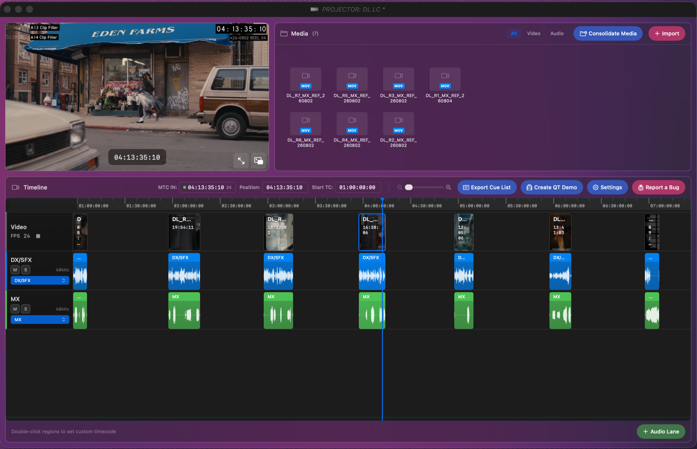

# Projector

**Projector is free, and the source is right here. It always will be.**

If it saves you time, please put money toward [**Altadena Girls**](https://www.altadenagirls.org/) instead of toward us.

> ### ❤️ [Donate to Altadena Girls →](https://www.pledge.to/donate-altadena-girls)
>
> Altadena Girls is a nonprofit dedicated to supporting teen girls and those who
> identify with girlhood before, during, and after crisis — providing essentials,
> emotional support, and community.

---



---

## Download

**[⬇︎ Get the latest release](https://github.com/sopittedllc/Projector/releases/latest)** — a signed and notarized `.dmg`.

Drag Projector to your Applications folder and open it. No account, no license key, no trial.

Installed copies check for updates on their own and ask before installing one.

---

## What Projector is for

Projector is a macOS video player built for one job: **running picture for a scoring or
spotting session** and keeping it locked to the room.

Composers, music editors and supervisors get sent a reel and a cue sheet, and then spend
the session fighting the tools — a player that will not chase timecode, an editor that
takes a minute to open a 90-minute QuickTime, or a stem delivery that plays hard left and
hard right because the two halves were never meant to be heard together. Projector exists
to make that part disappear so the session can be about the music.

The workflow it is built around is deliberately narrow:

**import → optimize → place → sync**

1. **Import** a reel. Projector reads the timecode already embedded in it and puts it where
   it belongs on the timeline — no manual offset arithmetic.
2. **Optimize** heavy media when it needs it, so a high-bitrate master scrubs like a proxy.
3. **Place** stems against picture, on as many audio lanes as the session needs.
4. **Sync** the whole thing to your DAW over MTC/MMC, so hitting play in Pro Tools, Logic,
   Cubase or Nuendo rolls picture in step.

Everything else in the app is in service of those four steps.

## What it does

**Picture**

- Frame-accurate playback and seeking, with a configurable burned-in timecode overlay
- Multi-reel timelines — reels laid end to end, each keeping its own source timecode
- A dedicated player window that lives on a second display, with a **Lock to Foreground**
  pin so it stays visible over a fullscreen DAW
- Thumbnail filmstrips across the timeline, generated in the background
- The timeline frames what you just imported — zoomed and scrolled so every reel and clip
  is on screen, rather than a sliver against an empty two-hour field
- **Professional codecs macOS cannot decode on its own** — Avid DNxHD/DNxHR, AVC-Intra,
  DVCPRO HD, HDV, XDCAM, MPEG IMX, Apple Intermediate and Uncompressed 4:2:2. Projector
  registers Apple's pro video decoders at launch, and when a format is still missing it
  names it and offers to fetch the package, instead of playing black with no explanation.

**Sound**

- As many audio lanes as you need, with mute, solo, per-lane level and drag-to-reorder
- Multi-track audio: a video carrying several audio tracks becomes one lane per track
- Per-lane output routing to any channel pair on your interface, via Core Audio — including
  **None**, which parks a lane silently without touching its mute state
- Waveform display drawn from a multi-resolution atlas, so it stays responsive when zoomed
- **Hard-panned split detection** — a reel delivered as a split track (dialogue and effects
  on one side, music on the other) is detected on import by channel correlation and laid
  out as two lanes, DX/SFX and MX, each un-panned back to centre. A reel with one dead
  channel is surfaced the same way rather than quietly played one-sided.
- **Stems know where they go.** A file whose name says DX, SFX or MX is routed to the
  output you mapped to that role. Matching is word-based, so `MIXDOWN` is not read as MX.
- **Reel-based deliveries land as stems, not a staircase.** Five reels of dialogue and five
  of music arrive as two lanes, not ten — the stem is read from the end of the filename,
  the part a delivery keeps constant.

**Sync**

- MIDI Time Code (MTC) chase and MIDI Machine Control (MMC) transport
- Virtual MIDI ports, so no extra routing utility is needed
- Timecode entry anywhere you can type a position, in HH:MM:SS:FF
- **Stems into the DAW as inputs.** Projector builds a Core Audio aggregate pairing your
  interface with a loopback device — installing one if you have none — and puts the stems
  on inputs 1–4 in every DAW. Each input channel is named on the aggregate, so nothing
  shows a generic port list, and the loopback half is drift-compensated against your
  interface's clock so the two cannot slide apart over a reel.

**Session**

- Embedded timecode read from QuickTime tracks, BWF/broadcast WAV and XMP metadata
- **One frame rate per import.** A batch settles the project's rate before placing
  anything, imports what matches, and names what did not in a single report — nothing is
  silently dropped, and no destructive offer is made mid-batch.
- **Consolidate** media into the project folder, so the project is portable; **optimize**
  heavy media separately, so a high-bitrate master scrubs like a proxy. Frame rates and
  sample rates are preserved either way — nothing is quietly resampled to 30fps.
- **Create QT Demo** — a review QuickTime of picture against a stereo mix you supply, plus
  whichever lanes you tick, placed by the mix's own timecode and encoded at the source
  frame rate so it is worth judging sync against
- Cue list export
- Set the timeline's start to any region, so the reel you care about lands on frame 0
- Missing media is offered to you to relocate, skip, or skip for the rest of the load
- Projects saved as `.projector` documents, with a Quick Look preview
- Automatic update checks against a signed appcast — never silent, always asked first
- Built-in bug reporting that attaches a diagnostic log

## Requirements

- macOS 12 (Monterey) or later
- Any Core Audio output device — built-in output through to multi-channel interfaces

## Documentation

- [Getting Started](docs/user-guide/getting-started.md)
- [MIDI Sync Setup](docs/user-guide/midi-sync-setup.md)
- [Audio Routing Guide](docs/user-guide/audio-routing-guide.md)
- [Keyboard Shortcuts](docs/user-guide/keyboard-shortcuts.md)
- [Troubleshooting](docs/user-guide/troubleshooting.md)

## Building from source

```bash
git clone https://github.com/sopittedllc/Projector.git
cd Projector
open Projector.xcodeproj
```

Select the **Projector** scheme and build (⌘R). Xcode 15 or later. Code signing is only
needed if you intend to distribute your own build.

## Architecture

Two layers, with a hard boundary between them. Views never reach into Core Audio or
CoreMIDI; managers never import SwiftUI. Everything crosses the line through protocols and
`Sendable` types.

```
┌─────────────────────────────────────────────────────────────────┐
│                     PRESENTATION LAYER                          │
│   SwiftUI Views  →  ViewModels (@MainActor)  →  THE CONTRACT    │
├─────────────────────────────────────────────────────────────────┤
│                        THE CONTRACT                             │
│   Protocols + AsyncStreams + Sendable Types                     │
├─────────────────────────────────────────────────────────────────┤
│                        LOGIC LAYER                              │
│   Swift Actors  ←  CoreMIDI/CoreAudio  ←  Real-time Callbacks   │
└─────────────────────────────────────────────────────────────────┘
```

| Component | Purpose |
|-----------|---------|
| `PlaybackEngine` | AVFoundation playback, audio graph, output routing |
| `TimelineManager` | Timeline state and CRUD operations |
| `TimelineActor` | Thread-safe timeline operations via AsyncStream |
| `TransportActor` | Transport control with frame-accurate positioning |
| `MIDISyncActor` | MTC/MMC parsing and sync state |
| `AudioOutputManager` | Core Audio device and channel mapping |
| `AudioPanningAnalyzer` | Hard-panned split detection |
| `AggregateDeviceManager` | Builds the DAW-routing aggregate and its channel map |
| `MediaOptimizationService` | Transcoding and consolidation, frame/sample rates preserved |
| `QuickTimeDemoBuilder` | Review-QuickTime composition, mix and export |
| `ProVideoFormats` | Pro codec decoder registration and package detection |

```
Projector/
├── Projector/
│   ├── Views/                  # SwiftUI views
│   ├── ViewModels/             # @MainActor view models
│   ├── Managers/               # Business logic (actors, services)
│   ├── Models/                 # Data structures
│   ├── Contracts/              # Service protocols
│   ├── Coordinators/           # Alert/sheet coordination
│   └── Utilities/              # Layout constants, helpers
├── ProjectorTests/             # Unit tests
├── ProjectorUITests/           # UI tests
├── ProjectorQuickLook/         # Quick Look extension
└── docs/                       # Documentation
```

## Contributing

[CLAUDE.md](CLAUDE.md) documents the standards any contribution is held to — the layer
rules above, Swift concurrency for anything touching MIDI or transport, DocC on public API,
named constants over magic numbers, and runtime verification for UI changes.

- [PROJECT_ROADMAP.md](PROJECT_ROADMAP.md) — progress tracking
- [FEATURES.md](FEATURES.md) — feature registry
- [KNOWLEDGE_BASE.md](KNOWLEDGE_BASE.md) — patterns and lessons learned

## License

[MIT](LICENSE) — free to use, modify and redistribute, including commercially.

Copyright © 2026 Keegan DeWitt / Musique LA.

---

<div align="center">

**Projector costs nothing.**
[Give what it would have cost to Altadena Girls →](https://www.pledge.to/donate-altadena-girls)

</div>
